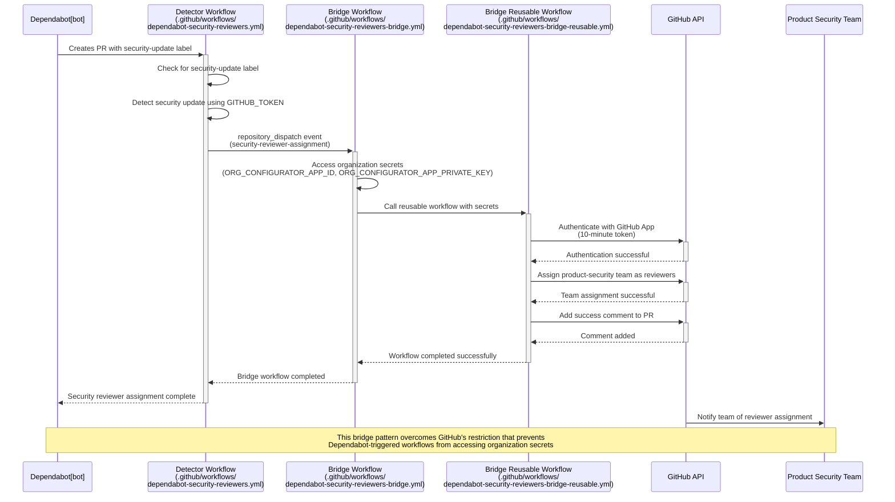
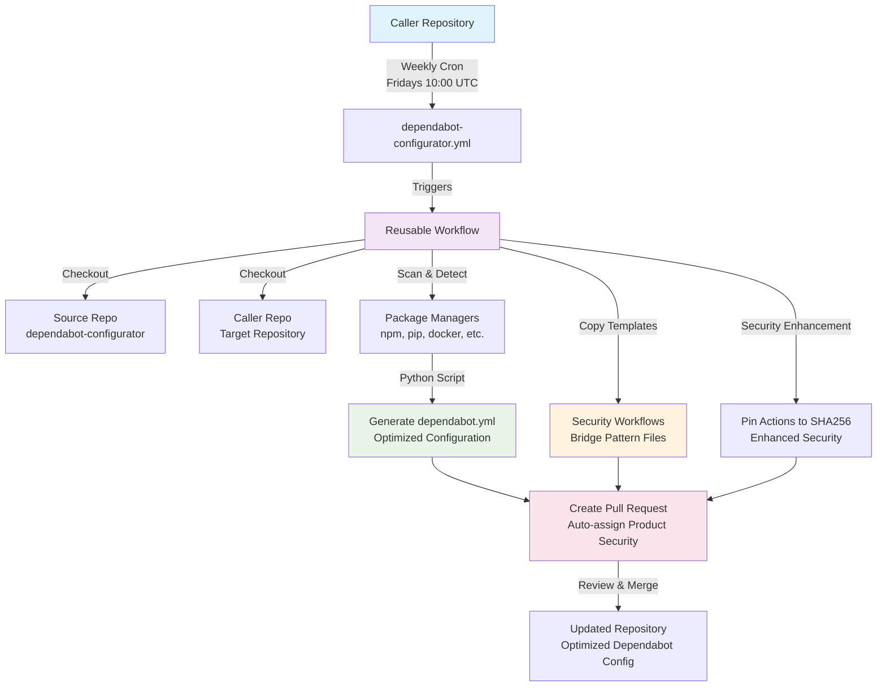
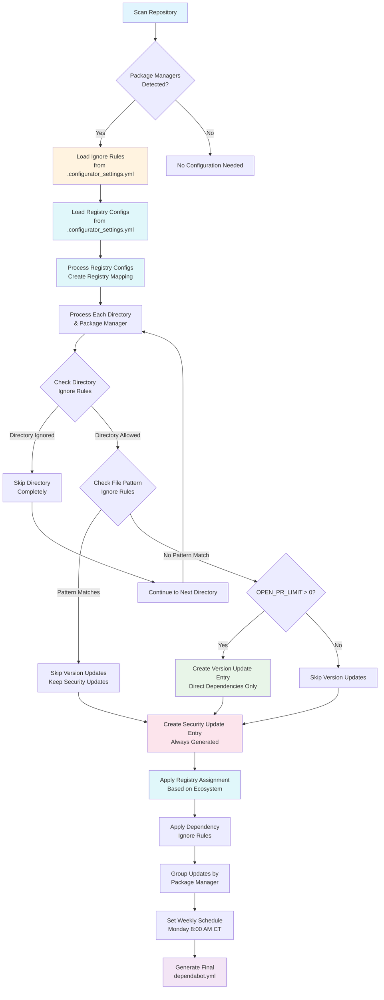

<a id="readme-top"></a>

<br />
<div align="center">
  <a href="https://github.com/redcanaryco/dependabot-configurator">  </a>
<h2 align="center">Dependabot Configurator</h2>

  <p align="center">
    An easy tool to automatically optimize and maintain Dependabot configurations<br>
    
  </p>
</div>

## Overview

Dependabot Configurator makes Dependabot actually useful for engineering and security teams while giving both teams control and ownership to the things they care about. [You can read why Configurator was created and use cases it solves on the Red Canary announcement blog post.](https://redcanary.com/blog/threat-detection/dependabot-configurator/)

Dependabot is great on paper, but is usually very lackluster in practice. Without a lot of configuration, updates are sporadic, unpredictable, and oftentimes can even introduce problems (like uplifting a transitive dependency which breaks the primary dependency!). Even if you get the configuration just perfect, there is ongoing maintenance anytime a package manager is introduced or changed.

For all these reasons, engineering teams often mute or ignore dependabot and never use it.

## Enter Dependabot Configurator

Dependabot Configurator does all the heavy lifting to create an optimized configuration for engineering teams and using dependabot configurator is very simple. Dependabot Configurator is an action that runs weekly. When run in your repository, it will check out your repository's code, crawl through it, build a highly-optimized dependabot configuration file, and then open a PR against your repository to update the configuration file.

## Table of Contents

- [Features](#features)
- [Configuration Options](#configuration-options)
  - [Workflow Parameters](#workflow-parameters)
  - [Example Workflow Configuration](#example-workflow-configuration)
  - [Configurator Settings File](#configurator-settings-file)
  - [Ignore Rules](#ignore-rules)
  - [Custom Files Configuration](#custom-files-configuration)
  - [Registry Configuration](#registry-configuration)
- [Setup Guide](#setup-guide)
  - [Prerequisites](#prerequisites)
  - [Step 1: Fork and Clone](#step-1-fork-and-clone)
  - [Step 2: Create GitHub App](#step-2-create-github-app)
  - [Step 3: Configure Organization Secrets](#step-3-configure-organization-secrets)
  - [Step 4: Customize Your Fork](#step-4-customize-your-fork)
  - [Step 5: Customization Checklist](#step-5-customization-checklist)
  - [Step 6: Deploy to Your Repositories](#step-6-deploy-to-your-repositories)
- [Advanced Topics](#advanced-topics)
  - [Customizing the Configuration PR Template](#customizing-the-configuration-pr-template)
- [Technical Details](#technical-details)
  - [Authentication and Security](#authentication-and-security)
  - [Security Reviewer Workflow](#security-reviewer-workflow)
  - [Architecture Diagrams](#architecture-diagrams)

## Features

- **Direct Dependencies Only**: Only receive direct dependency updates! No more time-consuming, impossible to uplift transitive dependencies. Optionally, teams may opt-in for security-related transitive dependencies.
- **Security-First Approach**: If your dependencies are in a bad state, you can disable all version updates and only get security updates.
- **Security Team Integration**: Security updates automatically tag Product-Security. Product Security can then respond in the PR and provide guidance.
- **Advanced Registry Support**: Configure custom registries with authentication for private package repositories, with automatic ecosystem-specific assignment.
- **Flexible Ignore Rules**: Ignore certain directories like `./spec/` or particularly loud packages with granular control.
- **Custom File Specifications**: Manually specify files that should be included in the Dependabot configuration, even if they don't match standard patterns.
- **Predictable Updates**: Group dependency updates into a single PR once a week so your product teams can predictably plan time for reviewing dependency updates.
- **Enhanced Security**: GitHub action pinning to SHA256 for increased security and supply chain protection.
- **Improved Reliability**: Dependabot just works better. It turns out that explicitly defining package manager locations causes dependabot to behave more reliably ¯\\\_(ツ)\_/¯.

## Configuration Options

Dependabot Configurator offers several ways to customize its behavior to fit your organization's needs. These configurations control which PRs are created, which dependencies are ignored, and more.

### Workflow Parameters

These parameters are set in your workflow file:

- **`OPEN_PULL_REQUESTS_LIMIT`**: Maximum number of version update PRs open at once (0 = security updates only)
- **`TRANSITIVE_SECURITY`**: Enable security updates for transitive dependencies (disabled by default)
- **Schedule**: Customizable schedule for when Configurator will run to updated dependabot's configuration and/or
  pin actions.

### Example Workflow Configuration

```yaml
name: Dependabot Configurator
on:
  schedule:
    - cron: "0 10 * * 5" # Runs every Friday at 10:00 UTC
  workflow_dispatch: # Allows manual triggering

jobs:
  dependabot-configurator:
    uses: YOUR_ORG/dependabot-configurator/.github/workflows/dependabot-configurator-reusable-workflow.yml@main
    with:
      MAIN_BRANCH: ${{ github.ref_name }}
      OPEN_PULL_REQUESTS_LIMIT: 1
      TRANSITIVE_SECURITY: false # Set to true to enable transitive security updates
    secrets:
      ORG_CONFIGURATOR_APP_ID: ${{ secrets.ORG_CONFIGURATOR_APP_ID }}
      ORG_CONFIGURATOR_APP_PRIVATE_KEY: ${{ secrets.ORG_CONFIGURATOR_APP_PRIVATE_KEY }}
```

### Configurator Settings File

Most customizations are done through the `.github/.configurator_settings.yml` file in your repository. This optional file allows teams to:

1. Ignore specific dependencies
2. Ignore entire directories
3. Ignore version updates for specific files
4. Add custom files in non-standard locations
5. Configure private registries

Here's an example of a complete settings file:

```yaml
# Dependabot Configurator Settings
# This file is optional - only create it if you need custom configurations

# Ignore specific dependencies for version updates
- ignore-dependency:
    - package-ecosystem: "pip"
      dependency-name: "github.com/aws/aws-sdk-go-v2*"
      update-types:
        - "version-update:semver-patch"

# Ignore entire directories for version updates
- ignore-directory: ["/vendor/", "/node_modules/"]

# Ignore version updates for files matching specific patterns
- ignore-version-updates-for-files:
    - "requirements_prod.txt"
    - "*_dev.txt"
    - "package-lock.json"

# Custom files to manually add to dependabot configuration
- custom-files:
    - path: "custom/path/to/Dockerfile.prod"
      manager: "docker"
    - path: "scripts/requirements-special.txt"
      manager: "pip"

# Registry configurations (if needed)
- registries:
    - name: pypi-mirror
      type: python-index
      url: https://pypi.example.com/simple
      username: pypi-user
      password: ${{ secrets.PYPI_PASSWORD }}
      applies-to: ["pip"]
```

### Ignore Rules

#### Ignoring Specific Dependencies

You can ignore specific dependencies for version updates while still receiving security updates:

```yaml
- ignore-dependency:
    - package-ecosystem: "pip"
      dependency-name: "requests"
      update-types:
        - "version-update:semver-patch"
    - package-ecosystem: "npm"
      dependency-name: "lodash"
      update-types:
        - "version-update:semver-minor"
        - "version-update:semver-patch"
```

#### Ignoring Directories

You can ignore entire directories for version updates (security updates will still be enabled):

```yaml
- ignore-directory: ["/vendor/", "/node_modules/", "/legacy/"]
```

#### Ignoring Files

You can ignore version updates for files matching specific patterns:

```yaml
- ignore-version-updates-for-files:
    - "requirements_prod.txt"
    - "*_dev.txt"
    - "package-lock.json"
```

### Custom Files Configuration

The Dependabot Configurator automatically detects package manager files in your repository, but sometimes you may have files in non-standard locations or with non-standard names that should also be monitored by Dependabot. The `custom-files` configuration allows you to manually specify additional files for Dependabot to monitor.

#### Custom Files Configuration Syntax

In your `.github/.configurator_settings.yml` file, add a `custom-files` section:

```yaml
- custom-files:
    - path: "custom/path/to/Dockerfile.prod"
      manager: "docker"
    - path: "scripts/requirements-special.txt"
      manager: "pip"
    - path: "non-standard/workflow.yml"
      manager: "github-actions"
```

#### Required Parameters

Each custom file entry requires two parameters:

- **path**: The relative path to the file from the repository root
- **manager**: The package ecosystem type for the file (must be one of the supported package managers)

#### Supported Package Managers

You can specify any of the following package managers in the `manager` field:

- `bundler` - Ruby Gemfiles
- `cargo` - Rust Cargo.toml files
- `composer` - PHP Composer files
- `docker` - Dockerfiles
- `elm` - Elm package files
- `github-actions` - GitHub Actions workflow files
- `gomod` - Go modules
- `gradle` - Gradle build files
- `maven` - Maven POM files
- `npm` - JavaScript/Node.js package files
- `nuget` - .NET project files
- `pip` - Python requirements files
- `pub` - Dart/Flutter pubspec files
- `swift` - Swift package files
- `terraform` - Terraform dependency files

#### Use Cases

This feature is particularly useful for:

1. **Non-standard file names**: e.g., `Dockerfile.prod` instead of `Dockerfile`
2. **Files in non-standard locations**: e.g., a requirements file outside of the typical project structure
3. **Multiple dependency files for the same package manager**: e.g., separate requirements files for different environments

Custom files are treated exactly like auto-detected files once they're added to the configuration, with all the same features including ignore rules and registry configurations.

### Registry Configuration

The Dependabot Configurator supports advanced registry configuration for package managers that require authentication or custom registry endpoints. Registry configurations are defined in a `.configurator_settings.yml` file in your repository's `.github/` directory.

#### Registry Configuration File

Create `.github/.configurator_settings.yml` in your repository:

```yaml
- registries:
    # Ecosystem-specific registry (only applies to pip)
    - name: pypi-mirror
      type: python-index
      url: https://pypi.example.com/simple
      username: pypi-user
      password: ${{ secrets.PYPI_PASSWORD }}
      applies-to: ["pip"]

    # Universal registry (applies to all package ecosystems)
    - name: universal-git
      type: git
      url: https://github.com
      username: git-user
      password: ${{ secrets.GIT_TOKEN }}

    # NPM registry with token authentication
    - name: npm-registry
      type: npm-registry
      url: https://npm.pkg.github.com
      token: ${{ secrets.NPM_TOKEN }}
      applies-to: ["npm"]

    # Docker registry
    - name: docker-hub
      type: docker-registry
      url: https://index.docker.io
      username: docker-user
      password: ${{ secrets.DOCKER_PASSWORD }}
      applies-to: ["docker"]
```

#### Registry Assignment Logic

- **Universal Registries**: Registries without an `applies-to` field are automatically assigned to all update entries
- **Ecosystem-Specific Registries**: Registries with an `applies-to` field are only assigned to matching package ecosystems
- **Mixed Configurations**: Both universal and ecosystem-specific registries can coexist in the same configuration
- **Automatic Assignment**: Registry assignment happens automatically during configuration generation

#### Supported Registry Types

The configurator supports all standard Dependabot registry types:

- `git` - Git repositories requiring authentication
- `npm-registry` - NPM registries (including GitHub Packages)
- `python-index` - Python package indexes (PyPI mirrors)
- `docker-registry` - Docker registries
- `maven-repository` - Maven repositories
- `nuget-feed` - NuGet feeds
- `rubygems-server` - RubyGems servers
- `terraform-registry` - Terraform registries

#### Authentication Patterns

Registry configurations support various authentication methods:

```yaml
# Username/password authentication
- name: basic-auth-registry
  type: python-index
  url: https://pypi.example.com/simple
  username: user
  password: ${{ secrets.PASSWORD }}

# Token-based authentication
- name: token-registry
  type: npm-registry
  url: https://npm.pkg.github.com
  token: ${{ secrets.NPM_TOKEN }}

# Key-based authentication
- name: key-registry
  type: maven-repository
  url: https://maven.example.com
  key: ${{ secrets.MAVEN_KEY }}

# Multiple authentication fields
- name: complex-registry
  type: docker-registry
  url: https://registry.example.com
  username: ${{ secrets.DOCKER_USER }}
  password: ${{ secrets.DOCKER_PASS }}
  key: ${{ secrets.DOCKER_KEY }}
```

**🔐 Security Note**: Always use GitHub secrets for sensitive authentication information. Never commit credentials directly to your repository.

## Setup Guide

### Prerequisites

- GitHub organization with admin access
- Self-hosted GitHub runners or GitHub-hosted runners
- Python 3.12+ environment

### Step 1: Fork and Clone

1. Fork this repository to your organization
2. Clone your fork locally
3. Copy the workflow template to the workflows directory:
   ```bash
   cp templates/workflows/dependabot-configurator.yml .github/workflows/
   ```
4. Update the organization reference in the workflow file (look for the `# CUSTOMIZE:` comment):
   ```yaml
   # CUSTOMIZE: Update this to point to your organization's fork
   # Change 'YOUR_ORG' to your organization name (e.g., 'acme-corp')
   uses: YOUR_ORG/dependabot-configurator/.github/workflows/dependabot-configurator-reusable-workflow.yml@main
   ```

### Step 2: Create GitHub App

1. **Create a GitHub App**:

   - Go to your organization settings → Developer settings → GitHub Apps
   - Click "New GitHub App"
   - Fill in the required fields:
     - **Name**: "Dependabot Configurator App"
     - **Homepage URL**: Your organization's URL or the repository URL
     - **Webhook**: Disable (not needed for this use case)

2. **Set Permissions**:

   - Repository permissions:
     - **Contents**: Read & write
     - **Pull requests**: Read & write
     - **Workflows**: Read and write
     - **Issues**: Read & write (necessary for creating labels)
     - **Metadata**: Read-only
   - Organization permissions:
     - **Members**: Read (required for team reviewer assignment)

3. **Generate a Private Key**:

   - After creating the app, scroll down to the "Private keys" section
   - Click "Generate a private key"
   - Save the downloaded .pem file securely

4. **Install the App**:
   - Scroll to the "Install App" tab
   - Click "Install" next to your organization
   - Choose whether to install on all repositories or select specific ones

### Step 3: Configure Organization Secrets

Add these secrets to your organization settings:

- **`ORG_CONFIGURATOR_APP_ID`**: The ID of your GitHub App
- **`ORG_CONFIGURATOR_APP_PRIVATE_KEY`**: The private key of your GitHub App (entire .pem file content)

### Step 4: Customize Your Fork

Update the following clearly marked customization points in your fork:

#### **Main Workflow** (`.github/workflows/dependabot-configurator-reusable-workflow.yml`)

1. **Runner Labels** (Line ~42):

   ```yaml
   # CUSTOMIZE: Update runner labels for your organization if self-hosted runners are desired.
   runs-on: [ubuntu-latest] # Change as needed
   ```

2. **Repository Reference** (Line ~95):

   ```yaml
   # CUSTOMIZE: Update this to point to your organization's fork
   # Change 'redcanaryco/dependabot-configurator' to 'your-org/dependabot-configurator'
   repository: redcanaryco/dependabot-configurator
   ```

3. **Organization Prefix** (Line ~145):

   ```yaml
   env:
     # CUSTOMIZE: Update this to your organization name
     # Change 'redcanaryco' to your organization prefix (e.g., 'acme-corp')
     ORGANIZATION_PREFIX: redcanaryco
   ```

4. **Security Team Reviewer** (Line ~185):
   ```yaml
   # CUSTOMIZE: Update this to your organization's security team
   # Change 'redcanaryco/product-security' to 'your-org/your-security-team'
   reviewers: redcanaryco/product-security
   ```

#### **Security Bridge Template** (`templates/workflows/dependabot-security-reviewers-bridge.yml`)

1. **Repository Reference** (Line ~10):
   ```yaml
   # CUSTOMIZE: Update this to point to your organization's fork
   # Change 'redcanaryco/dependabot-configurator' to 'your-org/dependabot-configurator'
   uses: redcanaryco/dependabot-configurator/.github/workflows/dependabot-security-reviewers-bridge-reusable.yml@main
   ```

#### **Security Bridge Reusable** (`.github/workflows/dependabot-security-reviewers-bridge-reusable.yml`)

1. **Runner Labels** (Line ~22):

   ```yaml
   # CUSTOMIZE: Update runner labels for your organization
   runs-on: [ubuntu-latest] # Change as needed
   ```

2. **Security Team Name** (Line ~58):

   ```yaml
   # CUSTOMIZE: Update security team name for your organization
   # Change 'product-security' to your security team name (e.g., 'security', 'infosec')
   team_reviewers: ["product-security"]
   ```

3. **Success Message** (Line ~65):

   ```yaml
   # CUSTOMIZE: Update team name in success message
   # Change 'Product Security' to your security team's display name
   body: "🔒 Product Security team has been automatically assigned to review this security update."
   ```

4. **Fallback Message** (Line ~76):
   ```yaml
   # CUSTOMIZE: Update organization and team references in fallback message
   # Change '@redcanaryco/product-security' to '@your-org/your-security-team'
   body: '🔒 **Security Update Detected** - This PR contains security-related dependency updates that require Product Security team review. Please manually assign the @redcanaryco/product-security team for review.\n\n*Automated team assignment failed - please check workflow logs for details.*'
   ```

#### **Security Reviewer Template** (`templates/workflows/dependabot-security-reviewers.yml`)

1. **Runner Labels** (Line ~10):
   ```yaml
   # CUSTOMIZE: Update runner labels for your organization
   runs-on: [ubuntu-latest] # Change as needed
   ```

### Step 5: Customization Checklist

Use this checklist to ensure you've updated all necessary customization points:

- [ ] **Template workflow file**: Copied template from `templates/workflows/dependabot-configurator.yml` to `.github/workflows/` and updated `YOUR_ORG` reference
- [ ] **Runner labels**: Updated from `[ubuntu-latest]` to your preferred runners
- [ ] **Repository references**: Changed `redcanaryco/dependabot-configurator` to `your-org/dependabot-configurator`
- [ ] **Organization prefix**: Updated all instances of `ORGANIZATION_PREFIX: redcanaryco` to `ORGANIZATION_PREFIX: your-org`
- [ ] **Security team name**: Changed `product-security` to your security team name
- [ ] **Security team references**: Updated `@redcanaryco/product-security` to `@your-org/your-security-team`
- [ ] **PR reviewers**: Updated `reviewers: redcanaryco/product-security` to your team
- [ ] **Caller repositories**: Updated workflow references to point to your fork

### Step 6: Deploy to Your Repositories

Once you've set up and customized your fork, you can deploy Dependabot Configurator to your repositories:

#### Add the Workflow File

Copy this workflow file to your repository's `.github/workflows/` directory:

```yaml
name: Dependabot Configurator
# Documentation at {link to your repository fork}
on:
  schedule:
    - cron: "0 10 * * 5" # Runs every Friday at 10:00 UTC
  workflow_dispatch:

jobs:
  dependabot-configurator:
    uses: YOUR_ORG/dependabot-configurator/.github/workflows/dependabot-configurator-reusable-workflow.yml@main
    with:
      MAIN_BRANCH: ${{ github.ref_name }}
      OPEN_PULL_REQUESTS_LIMIT: 1 # Set your desired limit. This applies to version updates only. 0 is none.
      # TRANSITIVE_SECURITY: true # This will enable transitive security updates
    secrets:
      ORG_CONFIGURATOR_APP_ID: ${{ secrets.ORG_CONFIGURATOR_APP_ID }}
      ORG_CONFIGURATOR_APP_PRIVATE_KEY: ${{ secrets.ORG_CONFIGURATOR_APP_PRIVATE_KEY }}
```

#### Add Configuration File (Optional)

If you need custom ignore rules or registry configurations, create `.github/.configurator_settings.yml` in your repository:

```yaml
# Dependabot Configurator Settings
# This file is optional - only create it if you need custom configurations

# Ignore specific dependencies for version updates
# - ignore-dependency:
#     - package-ecosystem: "pip"
#       dependency-name: "github.com/aws/aws-sdk-go-v2*"
#       update-types:
#         - "version-update:semver-patch"

# Ignore entire directories for version updates
# - ignore-directory: ["/vendor/", "/node_modules/"]

# Ignore version updates for files matching specific patterns
# - ignore-version-updates-for-files:
#     - "requirements_prod.txt"
#     - "*_dev.txt"
#     - "package-lock.json"

# Custom files to manually add to dependabot configuration
# - custom-files:
#     - path: "custom/path/to/Dockerfile.prod"
#       manager: "docker"
#     - path: "scripts/requirements-special.txt"
#       manager: "pip"

# Registry configurations (if needed)
# - registries:
#     - name: pypi-mirror
#       type: python-index
#       url: https://pypi.example.com/simple
#       username: pypi-user
#       password: ${{ secrets.PYPI_PASSWORD }}
#       applies-to: ["pip"]
```

## Advanced Topics

### Customizing the Configuration PR Template

When Dependabot Configurator runs, it creates a PR to update your repository's dependabot configuration. You can customize the title and body of this PR by editing the reusable workflow in your fork.

**Edit the Reusable Workflow File**:

- Open `.github/workflows/dependabot-configurator-reusable-workflow.yml` in your fork
- Locate the "Create Pull Request" step (towards the end of the file)
- Modify the `title` and `body` parameters according to your preferences

## Technical Details

### Authentication and Security

Dependabot Configurator uses GitHub App authentication for improved security:

- **Short-lived tokens**: Generates 10-minute tokens for each workflow run
- **Granular permissions**: Uses only the minimum permissions needed
- **Audit trail**: All actions are clearly identified in GitHub audit logs
- **Commit signing**: Commits are verified as coming from the GitHub App

### Security Reviewer Workflow

The Dependabot Configurator automatically generates security reviewer assignment workflows that ensure all security updates receive proper Product Security team review. This system uses a sophisticated bridge pattern architecture to overcome GitHub's security limitations with Dependabot-triggered workflows and is a viable, albeit complicated solution after Github retired the reviewers field.

#### How It Works

1. **Security Update Detection**: Automatically detects Dependabot security updates using the `security-update` label
2. **Team Assignment**: Assigns the `product-security` team as reviewers to the PR
3. **Notification**: Adds informative comments to the PR for visibility
4. **Error Handling**: Provides clear success/failure feedback

#### Bridge Pattern Architecture

The security reviewer system uses a three-component bridge pattern to overcome GitHub's restriction that prevents Dependabot-triggered workflows from accessing organization secrets:



**1. Detector Workflow** (`.github/workflows/dependabot-security-reviewers.yml`):

- Triggers on Dependabot pull requests (`pull_request` events from `dependabot[bot]`)
- Uses `GITHUB_TOKEN` with `contents: write` permission to detect security updates
- Creates a `repository_dispatch` event to communicate with the bridge workflow
- Runs on self-hosted runners for organization compatibility

**2. Bridge Workflow** (`.github/workflows/dependabot-security-reviewers-bridge.yml`):

- Triggers on `repository_dispatch` events with type `security-reviewer-assignment`
- Has access to organization secrets (`ORG_CONFIGURATOR_APP_ID` and `ORG_CONFIGURATOR_APP_PRIVATE_KEY`)
- Passes PR information and secrets to the reusable workflow

**3. Bridge Reusable Workflow** (`.github/workflows/dependabot-security-reviewers-bridge-reusable.yml`):

- Performs GitHub App authentication using organization secrets
- Assigns the `product-security` team as reviewers
- Creates success/failure comments on the PR
- Handles all GitHub API interactions with elevated permissions

#### Key Benefits

- **Organization-Wide Secret Management**: No need for repository-level secrets
- **Scalable**: Automatically works across all repositories in the organization
- **Secure**: Uses GitHub App authentication with minimal required permissions
- **Reliable**: Clear separation of concerns for better error handling and debugging
- **Automatic**: No manual configuration required - workflows are generated automatically

#### Technical Requirements

- Organization secrets configured for GitHub App authentication
- GitHub App with appropriate permissions for team assignment

This approach ensures that security updates get proper review while maintaining organization-level secret management and providing a scalable solution across all repositories.

### Architecture Diagrams

#### System Architecture Overview

The following diagram shows the complete end-to-end orchestration flow of the Dependabot Configurator system:



#### Configuration Generation Process

The following diagram shows how the Python script generates optimized dependabot.yml configurations by scanning repositories, applying ignore rules, and configuring registries:


